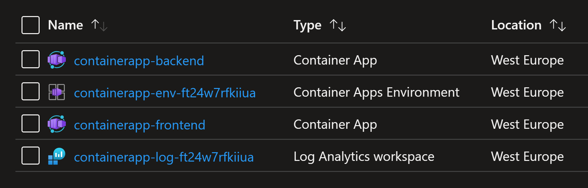

# Deploying an Azure Container Apps environment and container using Bicep

This template provides a way to deploy a Container App in a Container App Environment.
You need to create a resource group. Then you run the following caommands to create the following resources:
1. Log Analytics workspace
2. Container Apps Environment
3. Container Apps container for backend app using a sample docker image from Github registry (GHCR)
3. Container Apps container for frontend app using a sample docker image from Github registry (GHCR)



```powershell
$RESOURCE_GROUP="rg-aca-app-bicep"

# create new resource group
az group create --name $RESOURCE_GROUP --location westeurope

# preview the changes
az deployment group what-if `
              --name aca-demo-bicep `
              --resource-group $RESOURCE_GROUP `
              --template-file main.bicep

# apply the changes
az deployment group create `
              --name aca-demo-bicep `
              --resource-group $RESOURCE_GROUP `
              --template-file main.bicep
```

To delete these resources, run the following command.

```powershell
az deployment group delete `
              --name aca-demo-bicep `
              --resource-group $RESOURCE_GROUP
```

This template was originally provided in this Github repository: https://github.com/Azure/azure-quickstart-templates/blob/master/quickstarts/microsoft.app/container-app-create/