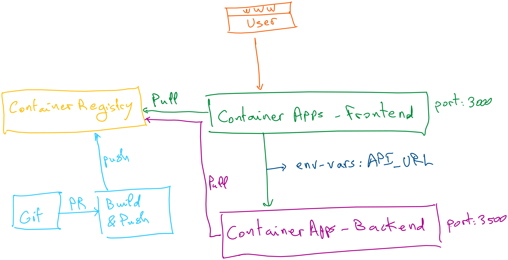
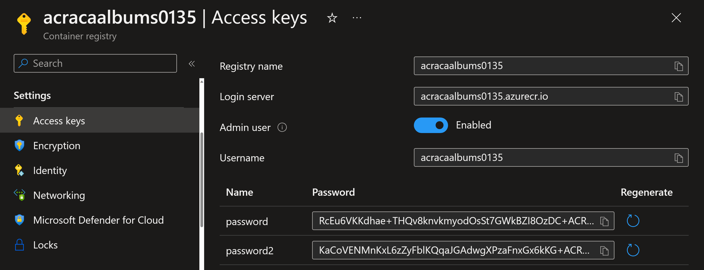
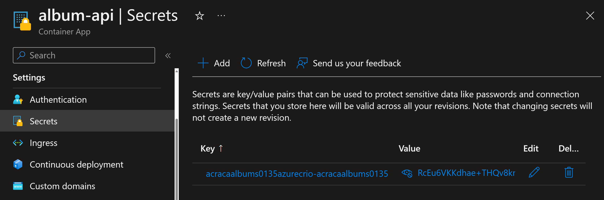
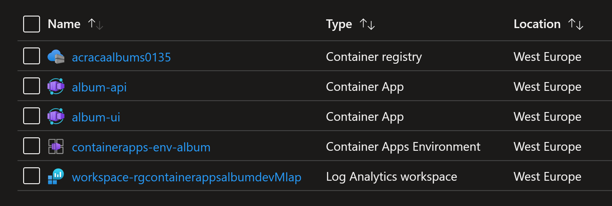

# Azure Container Apps lab

In this lab, you will learn how tobuild and deploy two applications, backend and frontend, into Azure Container Apps. You will be guided through these steps:

1. Create an Azure Container Registry (ACR)
2. Build container image (backend) using ACR
3. Deploy the backend image into Container Apps
4. Build container image (frontend) using ACR
5. Deploy the frontend image into Container Apps
6. Configure Container Apps target port number and environment variables




Setting environment variables

```powershell
$RESOURCE_GROUP = "rg-containerapps-album-dev"
$LOCATION = "westeurope"
$ACA_ENVIRONMENT = "containerapps-env-album"
$ACA_BACKEND_API="album-api"
$ACA_FRONTEND_UI="album-ui"
$ACR_NAME = "acracaalbums0135"
```

Create an Azure Container Registry

```powershell
az group create `
         --name $RESOURCE_GROUP `
         --location $LOCATION
```

Create an Azure Container Registry

```powershell
az acr create `
       --resource-group $RESOURCE_GROUP `
       --name $ACR_NAME `
       --sku Basic `
       --admin-enabled true
```

Build the container with ACR

```powershell
cd .\backend_api\backend_api_csharp\

az acr build --registry $ACR_NAME --image $ACA_BACKEND_API .
```

Create a Container Apps environment

```powershell
az containerapp env create `
                --name $ACA_ENVIRONMENT `
                --resource-group $RESOURCE_GROUP `
                --location $LOCATION
```

Deploy your backend image to a container app

```powershell
az containerapp create `
                --name $ACA_BACKEND_API `
                --resource-group $RESOURCE_GROUP `
                --environment $ACA_ENVIRONMENT `
                --image $ACR_NAME'.azurecr.io/'$ACA_BACKEND_API `
                --target-port 3500 `
                --ingress 'internal' `
                --registry-server $ACR_NAME'.azurecr.io' `
                --query properties.configuration.ingress.fqdn
```

Note the secrets section for ACR in ACA




Build the front end application

```powershell
cd ..\..\frontend_ui\

az acr build --registry $ACR_NAME --image $ACA_FRONTEND_UI .
```

Communicate between container apps

```powershell
$API_BASE_URL=$(az containerapp show --resource-group $RESOURCE_GROUP --name $ACA_BACKEND_API --query properties.configuration.ingress.fqdn -o tsv)

echo $API_BASE_URL
```

Deploy front end application

```powershell
az containerapp create `
  --name $ACA_FRONTEND_UI `
  --resource-group $RESOURCE_GROUP `
  --environment $ACA_ENVIRONMENT `
  --image $ACR_NAME'.azurecr.io/'$ACA_FRONTEND_UI  `
  --target-port 3000 `
  --env-vars API_BASE_URL=https://$API_BASE_URL `
  --ingress 'external' `
  --registry-server $ACR_NAME'.azurecr.io' `
  --query properties.configuration.ingress.fqdn
```

Check the application running under the displayed URL.


At the end, we should have these resources created.



Clean up resources

```powershell
az group delete --name $RESOURCE_GROUP --yes --no-wait
```

This lab was highly inspired by Microsoft documentation: https://learn.microsoft.com/en-us/azure/container-apps/tutorial-code-to-cloud and https://learn.microsoft.com/en-us/azure/container-apps/communicate-between-microservices