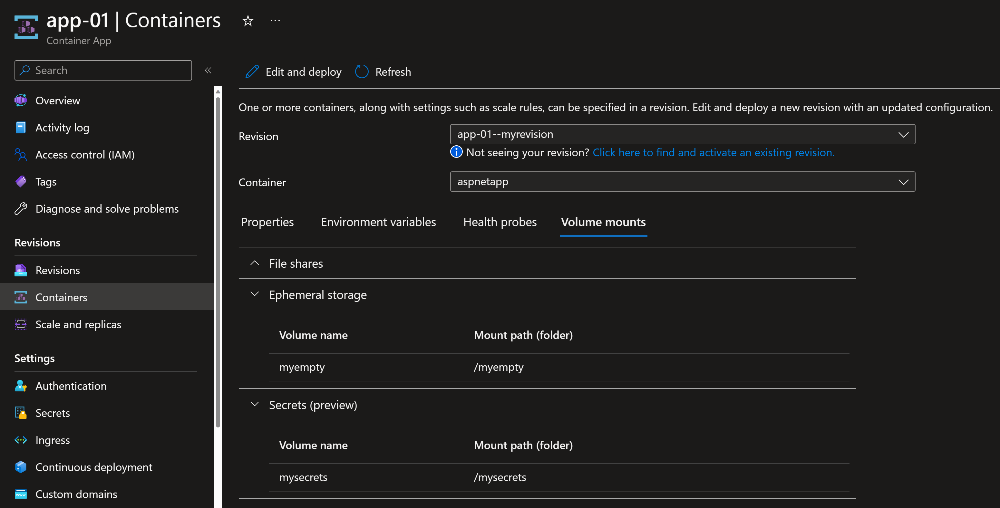
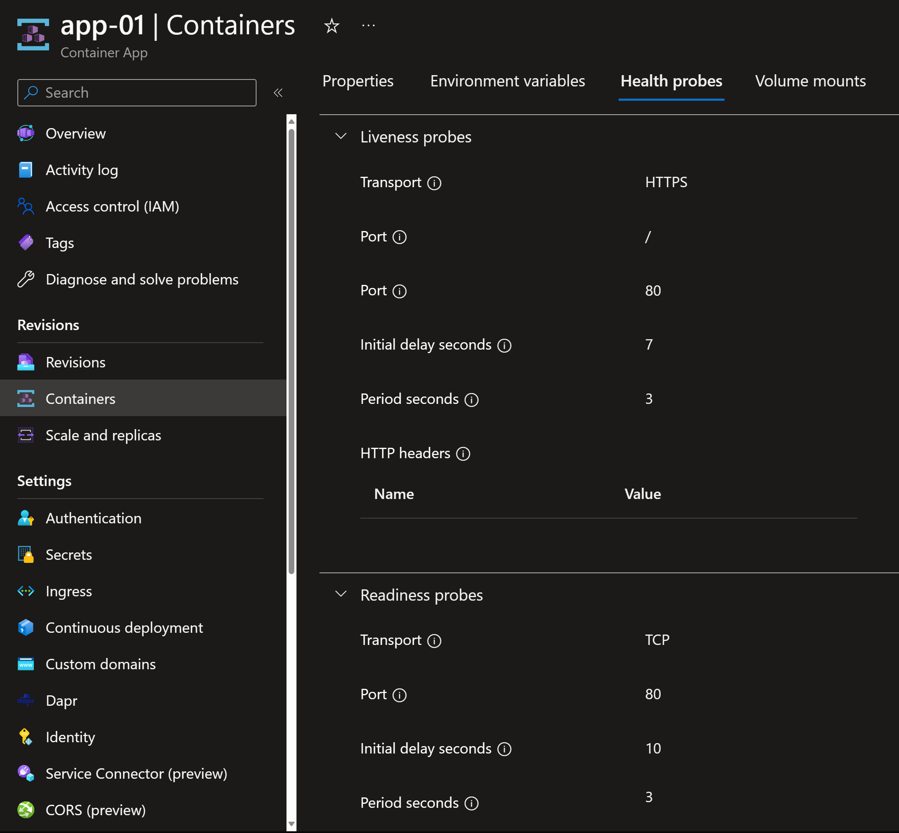
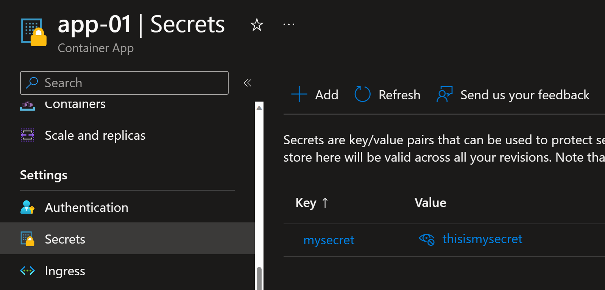

# Deploying Container App using YAML file

## Introduction

To create a new Container App, you can use:
1. Azure portal
2. Azure CLI
3. Terraform provider for Azure
4. YAML files

In this lab, you will work with YAML files.

**Note:**Creating ACA Environment using YAML file is not supported

## Create a Container Apps Environment

Create environment variables

```powershell
$RG="rg-aca"
$ACA_ENVIRONMENT="aca-environment"
$ACA_NAME="app-01"
```

Create resource group

```powershell
az group create -n $RG -l westeurope -o table
```

Create ACA environment

```powershell
az containerapp env create -n $ACA_ENVIRONMENT -g $RG -l westeurope -o table
```

## 2. Deploy containerapp using YAML file

Take a look at the structure of the sample YAML file `aca_app.template.yaml`.
You will create a new Container App to deploy a sample container image using YAML ile `aca_app.yaml`.
You will need to replace the environment resource ID in the YAML file.

Get the resource ID using the following command.

```powershell
$ACA_ENVIRONMENT_ID=$(az containerapp env show -n $ACA_ENVIRONMENT -g $RG --query id -o tsv)
echo $ACA_ENVIRONMENT_ID
```

Replace it in the YAML file.

Then deploy the YAML using the following command.

```powershell
az containerapp create -n $ACA_NAME -g $RG --yaml aca_app.yaml
```

## 3. Test the app by accessing it through the browser

```powershell
$ACA_FQDN=$(az containerapp show -n $ACA_NAME -g $RG --query properties.configuration.ingress.fqdn -o tsv)
echo $ACA_FQDN
Start-Process https://$ACA_FQDN
```

Verify the YAML configuration applied to the Container App in the portal.






## 4. Export YAML configuration for an existing Container App

If you have already deployed a Container App, you can export its YAML file using the following command.

```powershell
az containerapp show -n $ACA_NAME -g $RG -o yaml > aca_app_exported.yaml
```

This is useful if you used to use the Azure portal or command line and then you want to switch to YAML deployment.