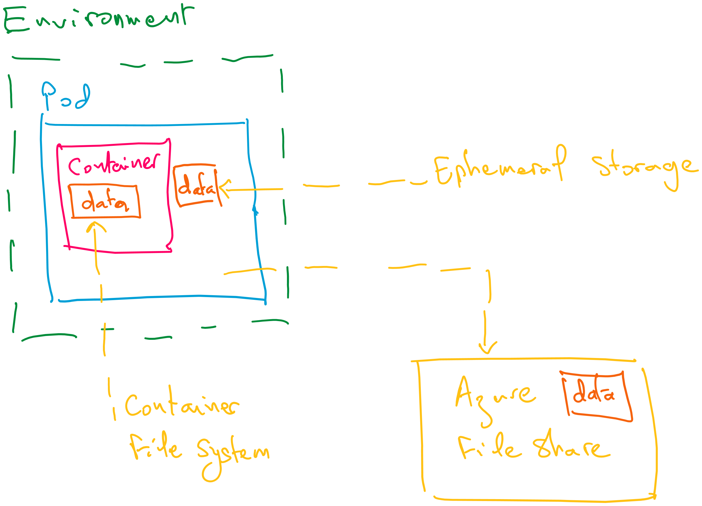
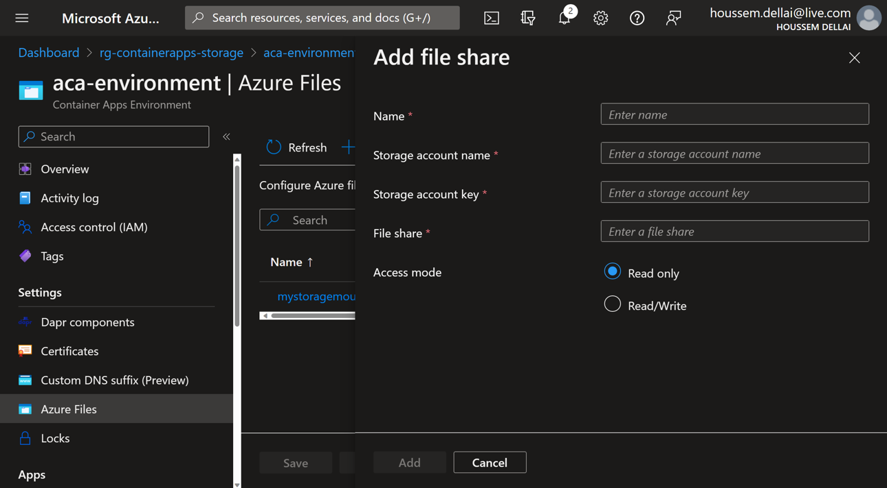
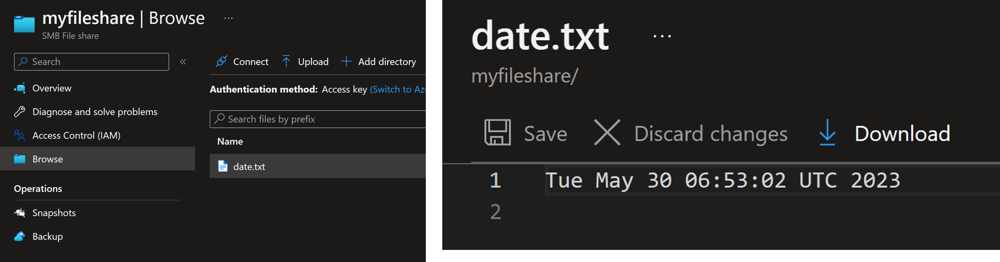

# Storage options for Container Apps

Azure Container Apps supports multiple storage options:
1. Container file system
2. Ephemeral storage
3. Azure File share



|Storage type| Description|Usage examples|
|------------|------------|--------------|
|Container file system|Temporary storage scoped to the local container|Writing a local app cache.|
|Ephemeral storage|Temporary storage scoped to an individual replica|Sharing files between containers in a replica. For instance, the main app container can write log files that are processed by a sidecar container.|
|Azure Files|Permanent storage|Writing files to a file share to make data accessible by other systems.|


## 1. Using container file system

```powershell
$RESOURCE_GROUP="rg-containerapps-storage"
$LOCATION="westeurope"
$CONTAINERAPPS_ENVIRONMENT="aca-environment"
$CONTAINERAPPS_APP="aca-nginx-app"

az group create `
         --name $RESOURCE_GROUP `
         --location $LOCATION `
         --output table

az containerapp env create `
                --name $CONTAINERAPPS_ENVIRONMENT `
                --resource-group $RESOURCE_GROUP `
                --location $LOCATION `
                --output table

az containerapp create `
                --name $CONTAINERAPPS_APP `
                --resource-group $RESOURCE_GROUP `
                --environment $CONTAINERAPPS_ENVIRONMENT `
                --image nginx:latest `
                --target-port 80 `
                --ingress 'external' `
                --output table

az containerapp exec -n $CONTAINERAPPS_APP -g $RESOURCE_GROUP
```

You will try to save data into the container file system. Run these commands inside the container.

```powershell
date > date.txt

cat date.txt
# Mon May 29 20:39:16 UTC 2023

exit
```

## 2. Using ephemeral storage

You will configure Container Apps to use Ephemeral storage.

```powershell
az containerapp show -n $CONTAINERAPPS_APP -g $RESOURCE_GROUP -o yaml > app_ephemeral_storage.yaml
```

Add the following to the `app_ephemeral_storage.yaml` file.

```yaml
volumeMounts:
- mountPath: /app-ephemeral-storage
  volumeName: ephemeral-storage
volumes:
- name: ephemeral-storage
storageType: EmptyDir
```

Apply the configuration YAML to Container Apps.

```powershell
az containerapp update -n $CONTAINERAPPS_APP -g $RESOURCE_GROUP --yaml app.yaml --output table
```

Then you will exec into the container and view the created Ephemeral storage.

```powershell
az containerapp exec -n $CONTAINERAPPS_APP -g $RESOURCE_GROUP --command ls
# INFO: Connecting to the container 'aca-nginx-app'...
# Use ctrl + D to exit.
# INFO: Successfully connected to container: 'aca-nginx-app'. [ Revision: 'aca-nginx-app--z1oc8uq', Replica: 'aca-nginx-app--z1oc8uq-bfcbbfd77-8qpgh']
# app-ephemeral-storage  dev                   etc   lib64  opt   run   sys  var
# bin                    docker-entrypoint.d   home  media  proc  sbin  tmp
# boot                   docker-entrypoint.sh  lib   mnt    root  srv   usr
# INFO: received success status from cluster
# Disconnecting...
```

## 3. Using Azure File share

```powershell
$RESOURCE_GROUP="rg-containerapps-storage-fileshare"
$LOCATION="westeurope"
$CONTAINERAPPS_ENVIRONMENT="aca-environment"
$CONTAINERAPPS_APP="aca-nginx-app"
$STORAGE_ACCOUNT_NAME="acafilestorage13579"
$STORAGE_SHARE_NAME="myfileshare"
$STORAGE_MOUNT_NAME="mystoragemount"
$ACA_APP_AZURE_FILE="aca-app-azure-file"
```

Create a resource group

```powershell
az group create `
         --name $RESOURCE_GROUP `
         --location $LOCATION `
         --output table

# Create an Azure Container Apps environment

az containerapp env create `
                --name $CONTAINERAPPS_ENVIRONMENT `
                --resource-group $RESOURCE_GROUP `
                --location $LOCATION `
                --output table
```

Create a storage account with Azure File share enabled

```powershell
az storage account create `
    --name $STORAGE_ACCOUNT_NAME `
    --resource-group $RESOURCE_GROUP `
    --location $LOCATION `
    --sku Standard_LRS `
    --enable-large-file-share `
    --output table

# create a file share

az storage share-rm create `
    --resource-group $RESOURCE_GROUP `
    --storage-account $STORAGE_ACCOUNT_NAME `
    --name $STORAGE_SHARE_NAME `
    --quota 1024 `
    --enabled-protocols SMB `
    --output table

# get storage account key

$STORAGE_ACCOUNT_KEY=$(az storage account keys list -n $STORAGE_ACCOUNT_NAME --query "[0].value" -o tsv)
```

Create a storage mount

```powershell
az containerapp env storage set `
     --access-mode ReadWrite `
     --azure-file-account-name $STORAGE_ACCOUNT_NAME `
     --azure-file-account-key $STORAGE_ACCOUNT_KEY `
     --azure-file-share-name $STORAGE_SHARE_NAME `
     --storage-name $STORAGE_MOUNT_NAME `
     --name $CONTAINERAPPS_ENVIRONMENT `
     --resource-group $RESOURCE_GROUP `
     --output table

# create a container app

az containerapp create `
     --name $ACA_APP_AZURE_FILE `
     --resource-group $RESOURCE_GROUP `
     --environment $CONTAINERAPPS_ENVIRONMENT `
     --image nginx:latest `
     --output table
```

Export container apps to YAML config file

```powershell
az containerapp show `
     --name $ACA_APP_AZURE_FILE `
     --resource-group $RESOURCE_GROUP `
     --output yaml > app_azure_file.yaml
```

Add the following to the `app_azure_file.yaml` file

```yaml
template:
  volumes:
  - name: my-azure-file-volume
    storageName: mystoragemount
    storageType: AzureFile
  containers:
  - image: nginx
    name: aca-app-azure-file
    volumeMounts:
    - volumeName: my-azure-file-volume
      mountPath: /app-azure-file
```

Update the container app with mount volume

```powershell
az containerapp update `
     --name $ACA_APP_AZURE_FILE `
     --resource-group $RESOURCE_GROUP `
     --yaml app_azure_file.yaml `
     --output table
```

You can also mount the File share using Azure portal.



Verify pod access to Azure File share

```powershell
az containerapp exec `
     --name $ACA_APP_AZURE_FILE `
     --resource-group $RESOURCE_GROUP
```

Run exec into the container and save data inside the container's File share.

```powershell
ls 
app-azure-file
date > app-azure-file/date.txt
cat app-azure-file/date.txt
# Mon May 29 20:39:16 UTC 2023 
```

You can also verify that data.txt file was saved into File share using Azure portal.



# 4. Using database container

```powershell
az containerapp create `
                --name "mysql-v8" `
                --resource-group $RESOURCE_GROUP `
                --environment $CONTAINERAPPS_ENVIRONMENT `
                --image mysql:8 `
                --target-port 3306 `
                --ingress 'internal' `
                --env-vars "MYSQL_ROOT_PASSWORD=@Aa123456789"

az containerapp exec -n $CONTAINERAPPS_APP -g $RESOURCE_GROUP --command sh
```

Inside the container:

```powershell
mysql --host="127.0.0.1" --user=root --password="@Aa123456789" -e "CREATE DATABASE test; CREATE TABLE test.messages (message VARCHAR(250)); INSERT INTO test.messages VALUES ('hello');"

mysql --host="127.0.0.1" --user=root --password="@Aa123456789" -e "SELECT * FROM test.messages"
# +---------+
# | message |
# +---------+
# | hello   |
# +---------+

ls var/lib/mysql/test/
# messages.ibd
```