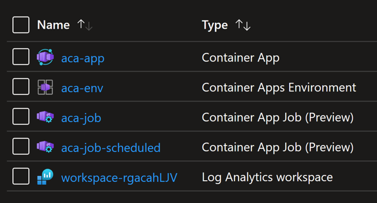

# Azure Container Apps Jobs

## Introduction

Azure Container Apps jobs enable you to run containerized tasks that execute for a finite duration and exit. You can use jobs to perform tasks such as data processing, machine learning, or any scenario where on-demand processing is required.

Container apps and jobs run in the same environment, allowing them to share capabilities such as networking and logging.

In this lab you will perform the following tasks:

1. Create a Container Apps Environment
2. Create and run a manual job
3. Start an execution of a manual job
4. List recent job execution history
5. Query job execution logs
6. Create and run a scheduled job

## 1. Create Container Apps Environment

```powershell
# Define environment variables

$ACA_RG="rg-aca"
$ACA_ENVIRONMENT="aca-env"
$ACA_JOB="aca-job"

# create resource group

az group create --name $ACA_RG --location westeurope

az containerapp env create --name $ACA_ENVIRONMENT --resource-group $ACA_RG --location westeurope -o table
```

At the end we would have the following resources:



## 2. Create and run a manual job

```powershell
az containerapp job create `
    --name $ACA_JOB --resource-group $ACA_RG  --environment $ACA_ENVIRONMENT `
    --trigger-type "Manual" `
    --replica-timeout 1800 --replica-retry-limit 1 --replica-completion-count 1 --parallelism 1 `
    --image "mcr.microsoft.com/k8se/quickstart-jobs:latest" `
    --cpu "0.25" --memory "0.5Gi"
```

Manual jobs don't execute automatically. You must start an execution of the job.

## 3. Start an execution of a manual job

```powershell
az containerapp job start --name $ACA_JOB --resource-group $ACA_RG
# {
#     "id": "/subscriptions/82f6d75e-85f4-434a-ab74-5dddd9fa8910/resourceGroups/rg-aca/providers/Microsoft.App/jobs/aca-job/executions/aca-job-p27d3de",
#     "name": "aca-job-p27d3de",
#     "resourceGroup": "rg-aca"
# }
```

## 4. List recent job execution history

```powershell
az containerapp job execution list `
    --name $ACA_JOB `
    --resource-group $ACA_RG `
    --output table
# Name             StartTime                  Status
# ---------------  -------------------------  ---------
# aca-job-p27d3de  2023-07-28T13:52:30+00:00  Succeeded
```

We can also check the execution history for Jobs from the Azure portal.

<image src="images/execution_history.png)

## 5. Query job execution logs

```powershell
# Save the Log Analytics workspace ID for the Container Apps environment to a variable.

$LOG_ANALYTICS_WORKSPACE_ID=$(az containerapp env show `
    --name $ACA_ENVIRONMENT `
    --resource-group $ACA_RG `
    --query "properties.appLogsConfiguration.logAnalyticsConfiguration.customerId" `
    --output tsv)

# Save the name of the most recent job execution to a variable.

$JOB_EXECUTION_NAME=$(az containerapp job execution list `
    --name $ACA_JOB `
    --resource-group $ACA_RG `
    --query "[0].name" `
    --output tsv)

# Run a query against Log Analytics for the job execution using the following command.

az monitor log-analytics query `
    --workspace $LOG_ANALYTICS_WORKSPACE_ID `
    --analytics-query "ContainerAppConsoleLogs_CL | where ContainerGroupName_s startswith '$JOB_EXECUTION_NAME' | order by _timestamp_d asc" `
    --query "[].Log_s"
# [
#     "2023/07/28 13:52:32 This is a sample application that demonstrates how to use Azure Container Apps jobs",
#     "2023/07/28 13:52:32 Starting processing...",
#     "2023/07/28 13:52:37 Finished processing. Shutting down!"
# ]
```

We can also view the logs from the Azure portal.

<image src="images/logs.png)

## 6. Create and run a scheduled job

```powershell
az containerapp job create `
    --name $ACA_JOB"-scheduled" --resource-group $ACA_RG --environment $ACA_ENVIRONMENT `
    --trigger-type "Schedule" `
    --replica-timeout 1800 --replica-retry-limit 1 --replica-completion-count 1 --parallelism 1 `
    --image "mcr.microsoft.com/k8se/quickstart-jobs:latest" `
    --cpu "0.25" --memory "0.5Gi" `
    --cron-expression "*/1 * * * *"
```

## Clean up resources

```powershell
az group delete --name $ACA_RG --yes --no-wait
```