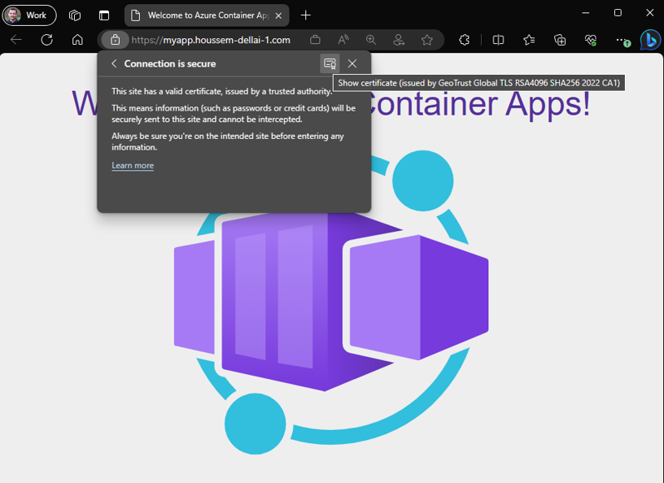
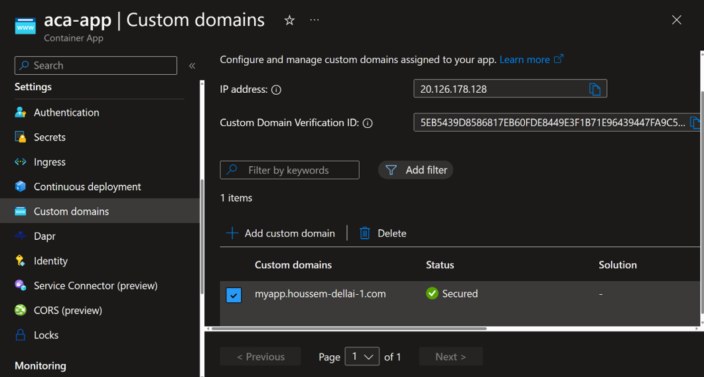
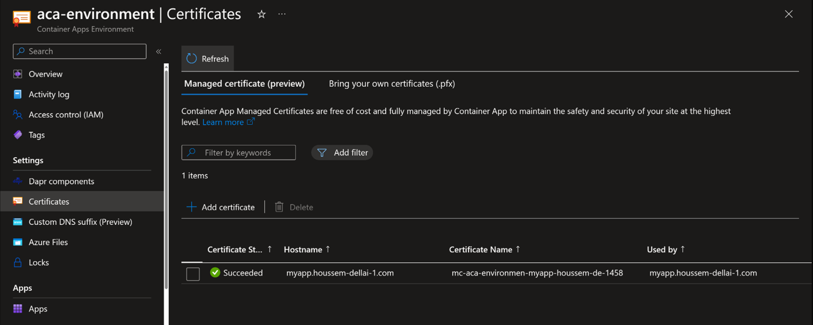

# Azure Container Apps Custom Domain Names

## Introduction

Azure Container Apps (ACA) are exposed to the internet using a domain name like `<APP_NAME>.<UNIQUE_IDENTIFIER>.<REGION_NAME>.azurecontainerapps.io`.
However, organisations would like to use their own custom domain names, like `mycompany.com`.
ACA allows you to bind one or more custom domains to a Container App. 
You can automatically configure a free managed certificate for your custom domain or bring your own certificate.

In this lab, you will create a new custom domain using `Azure App Service Domain`, free certificate and bind it to a Container App.

You will perform the following tasks:

1. Create a Container Apps Environment
2. Create an application with ingress enabled
3. Create an App Service Domain
4. Get the FQDN of the Container App and the IP address of the Container Apps Environment
5. Configure Custom Domain Names for Container App
6. Add the domain to your Container App
7. Verify the custom domain name and certificate

At the end you should have a Container App exposed through a custom domain and HTTPS enabled.



## 1. Create Container Apps Environment

Define environment variables

```powershell
$RG="rg-aca"
$LOCATION="westeurope"
$ACA_ENVIRONMENT="aca-environment"
$ACA_APP="aca-app"
$DOMAIN_NAME="houssem-dellai-1.com" # .com, .net, .co.uk, .org, .nl, .in, .biz, .org.uk, and .co.in
$SUBDOMAIN_NAME="myapp"
```

Create resource group and Container App Environment

```powershell
az group create --name $RG --location $LOCATION --output table
# Location    Name
# ----------  ------
# westeurope  rg-aca

az containerapp env create -n $ACA_ENVIRONMENT -g $RG -l $LOCATION -o table
# Location     Name             ResourceGroup
# -----------  ---------------  ---------------
# West Europe  aca-environment  rg-aca
```

## 2. Create an application with ingress enabled

```powershell
az containerapp create `
  --name $ACA_APP `
  --resource-group $RG `
  --environment $ACA_ENVIRONMENT `
  --image mcr.microsoft.com/azuredocs/containerapps-helloworld:latest `
  --target-port 80 `
  --ingress 'external' `
  --output table
# Name     Location     ResourceGroup    Fqdn
# -------  -----------  ---------------  ------------------------------------------------------------
# aca-app  West Europe  rg-aca           aca-app.braveriver-92489391.westeurope.azurecontainerapps.io
```

## 3. Create an App Service Domain

Make sure you fill the `contact_info.json` file. It is required to create domain name.

```powershell
az appservice domain create `
   --resource-group $RG `
   --hostname $DOMAIN_NAME `
   --contact-info=@'contact_info.json' `
   --accept-terms
# {}
```

This generates an app service domain and a Azure DNS Zone. The Azure DNS Zone is used to create DNS records for the domain.

You should have the following resources created.


## 4. Get the FQDN of the Container App and the IP address of the Container Apps Environment

Get the FQDN of the Container App  

```powershell
$FQDN=$(az containerapp show `
  --name $ACA_APP `
  --resource-group $RG `
  --query properties.configuration.ingress.fqdn `
  --output tsv)

echo $FQDN
# aca-app.braveriver-92489391.westeurope.azurecontainerapps.io
```

Get the IP address of the Container Apps Environment

```powershell
$IP=$(az containerapp env show `
  --name $ACA_ENVIRONMENT `
  --resource-group $RG `
  --query properties.staticIp `
  --output tsv)

echo $IP
# 20.126.178.128
```

Get the domain verification code

```powershell
$DOMAIN_VERIFICATION_CODE=$(az containerapp show -n $ACA_APP -g $RG -o tsv --query "properties.customDomainVerificationId")

echo $DOMAIN_VERIFICATION_CODE
# 5EB5439D8586817EB60FDE8449E3F1B71E96439447FA9C53144C8FB1985BA85D
```

## 5. Configure Custom Domain Names for Container App

You have two options, either with CAME for a subdomain or with A record for APEX / root domain

## Option 1. Create DNS records in Azure DNS Zone [CNAME record]

```powershell
az network dns record-set cname create `
   --name $SUBDOMAIN_NAME `
   --resource-group $RG `
   --zone-name $DOMAIN_NAME
# {
#   "TTL": 3600,
#   "etag": "67faed21-039b-4024-bc9c-443aca8d598e",
#   "fqdn": "myapp.houssem-dellai-1.com.",
#   "id": "/subscriptions/XXXXXX/resourceGroups/rg-aca/providers/Microsoft.Network/dnszones/houssem-dellai-1.com/CNAME/myapp",
#   "name": "myapp",
#   "provisioningState": "Succeeded",
#   "resourceGroup": "rg-aca",
#   "targetResource": {},
#   "type": "Microsoft.Network/dnszones/CNAME"
# }

az network dns record-set cname set-record `
   --record-set-name $SUBDOMAIN_NAME `
   --resource-group $RG `
   --zone-name $DOMAIN_NAME `
   --cname $FQDN
# {
#   "CNAMERecord": {
#     "cname": "aca-app.braveriver-92489391.westeurope.azurecontainerapps.io"
#   },
#   "TTL": 3600,
#   "etag": "e3370ba0-f27b-49e3-a816-2a4884243cb3",
#   "fqdn": "myapp.houssem-dellai-1.com.",
#   "id": "/subscriptions/XXXXXX/resourceGroups/rg-aca/providers/Microsoft.Network/dnszones/houssem-dellai-1.com/CNAME/myapp",
#   "name": "myapp",
#   "provisioningState": "Succeeded",
#   "resourceGroup": "rg-aca",
#   "targetResource": {},
#   "type": "Microsoft.Network/dnszones/CNAME"
# }
```

Create a TXT record for domain verification

```powershell
az network dns record-set txt create `
   --resource-group $RG `
   --zone-name $DOMAIN_NAME `
   --name "asuid.$SUBDOMAIN_NAME" 
# {
#   "TTL": 3600,
#   "TXTRecords": [],
#   "etag": "ec4c5d5e-db4e-4cf7-b36c-9aa43e8592c9",
#   "fqdn": "asuid.myapp.houssem-dellai-1.com.",
#   "id": "/subscriptions/XXXXXX/resourceGroups/rg-aca/providers/Microsoft.Network/dnszones/houssem-dellai-1.com/TXT/asuid.myapp",
#   "name": "asuid.myapp",
#   "provisioningState": "Succeeded",
#   "resourceGroup": "rg-aca",
#   "targetResource": {},
#   "type": "Microsoft.Network/dnszones/TXT"
# }

az network dns record-set txt add-record `
   --resource-group $RG `
   --zone-name $DOMAIN_NAME `
   --record-set-name "asuid.$SUBDOMAIN_NAME" `
   --value $DOMAIN_VERIFICATION_CODE
# {
#   "TTL": 3600,
#   "TXTRecords": [
#     {
#       "value": [
#         "5EB5439D8586817EB60FDE8449E3F1B71E96439447FA9C53144C8FB1985BA85D"
#       ]
#     }
#   ],
#   "etag": "283d793c-b9f5-4b0f-a18c-39ab0ee7a733",
#   "fqdn": "asuid.myapp.houssem-dellai-1.com.",
#   "id": "/subscriptions/XXXXXX/resourceGroups/rg-aca/providers/Microsoft.Network/dnszones/houssem-dellai-1.com/TXT/asuid.myapp",
#   "name": "asuid.myapp",
#   "provisioningState": "Succeeded",
#   "resourceGroup": "rg-aca",
#   "targetResource": {},
#   "type": "Microsoft.Network/dnszones/TXT"
# }
```

Verify the DNS Zone have the right records.


## 6. Add the domain to your container app

```powershell
az containerapp hostname add --hostname "$SUBDOMAIN_NAME.$DOMAIN_NAME" -g $RG -n $ACA_APP
# [
#   {
#     "bindingType": "Disabled",
#     "name": "myapp.houssem-dellai-1.com"
#   }
# ]
```

Configure the managed certificate and bind the domain to your container app

```powershell
az containerapp hostname bind --hostname "$SUBDOMAIN_NAME.$DOMAIN_NAME" -g $RG -n $ACA_APP --environment $ACA_ENVIRONMENT --validation-method CNAME
# [
#   {
#     "bindingType": "SniEnabled",
#     "certificateId": "/subscriptions/XXXXXX/resourceGroups/rg-aca/providers/Microsoft.App/managedEnvironments/aca-environment/managedCertificates/mc-aca-environmen-myapp-houssem-de-1458",
#     "name": "myapp.houssem-dellai-1.com"
#   }
# ]
```

Verify the custom domain binding is successful.



And note the default free certificate was created.



## 7. Verify the domain name

Verify the domain by navigating to the domain name in a browser. You should see the default page for the container app.

```powershell
echo "https://$SUBDOMAIN_NAME.$DOMAIN_NAME" # if using CNAME with subdomain
# https://myapp.houssem-dellai-1.com
```


## Option 2. Create DNS records in Azure DNS Zone [A record]

Create an A record for the root domain

```powershell
az network dns record-set a create `
   --name "@" `
   --resource-group $RG `
   --zone-name $DOMAIN_NAME

az network dns record-set a add-record `
   --record-set-name "@" `
   --resource-group $RG `
   --zone-name $DOMAIN_NAME `
   --ipv4-address $IP
```

Create a TXT record for domain verification

```powershell
az network dns record-set txt create `
   --resource-group $RG `
   --zone-name $DOMAIN_NAME `
   --name "asuid" 

az network dns record-set txt add-record `
   --resource-group $RG `
   --zone-name $DOMAIN_NAME `
   --record-set-name "asuid" `
   --value $DOMAIN_VERIFICATION_CODE

sleep 60
```

## 6. Add the domain to your container app

```powershell
az containerapp hostname add --hostname "$DOMAIN_NAME" -g $RG -n $ACA_APP
```

Configure the managed certificate and bind the domain to your container app

```powershell
az containerapp hostname bind --hostname $DOMAIN_NAME -g $RG -n $ACA_APP --environment $ACA_ENVIRONMENT --validation-method HTTP
```

## 7. Verify the domain name

Verify the domain name by navigating to the domain name in a browser. You should see the default page for the container app.

```powershell
echo "https://$DOMAIN_NAME" # if using A record with APEX / root domain
```

## Clean up resources

```powershell
az group delete --name $RG --yes --no-wait
```

More details: https://learn.microsoft.com/en-us/azure/container-apps/custom-domains-managed-certificates