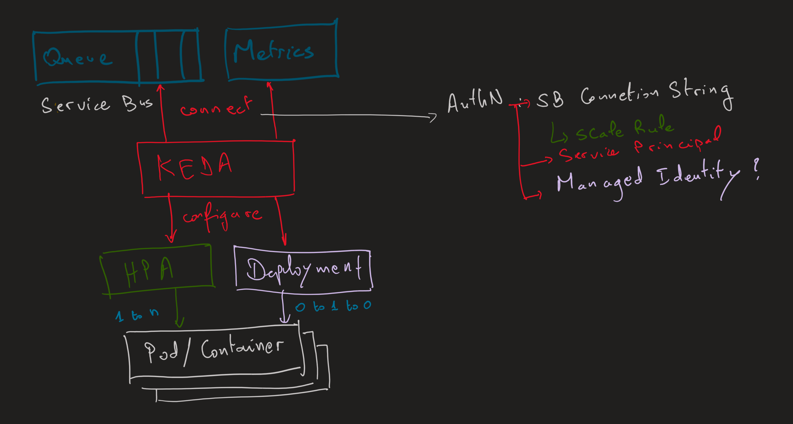
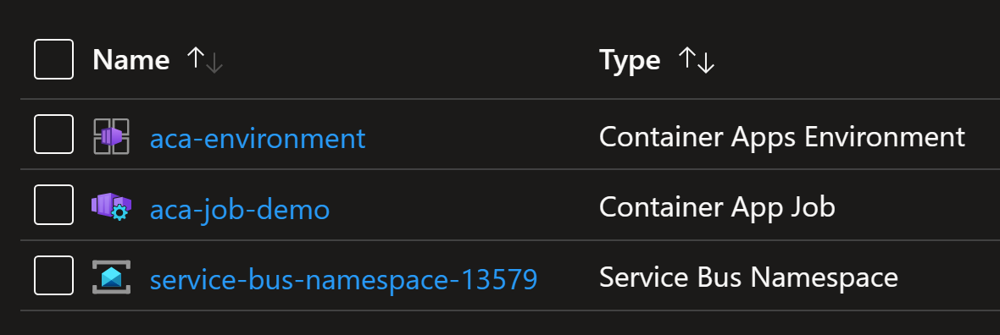
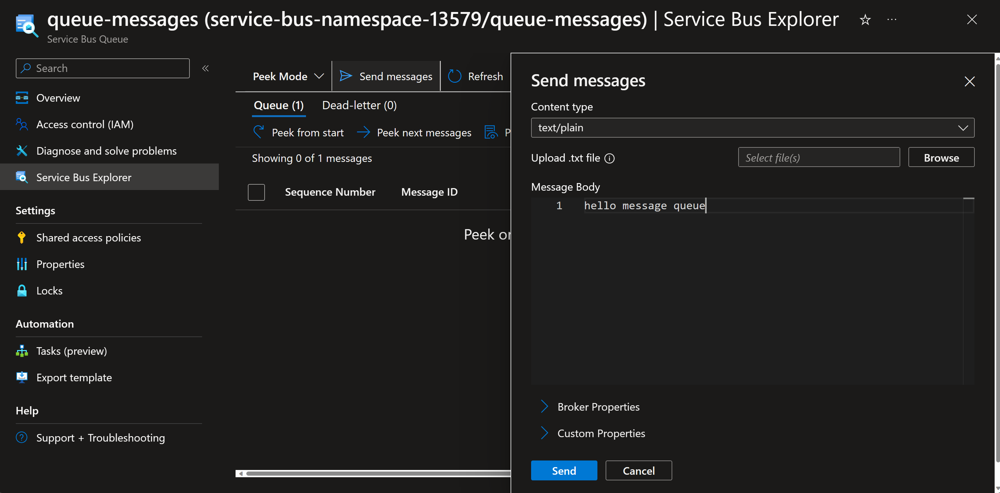
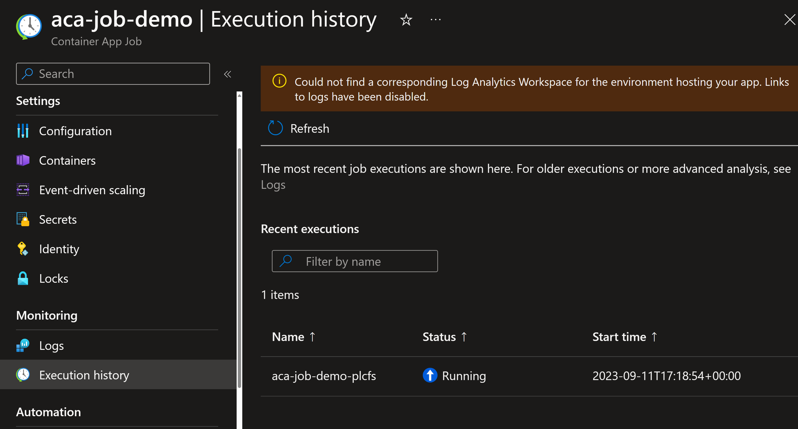

# Autoscaling Jobs using KEDA

## 1. Introduction

KEDA is a Kubernetes-based Event Driven Autoscaler. 
With KEDA, you can drive the scaling of any container in Kubernetes based on the number of events needing to be processed.

KEDA is a single-purpose and lightweight component that can be added into any Kubernetes cluster. KEDA works alongside standard Kubernetes components like the Horizontal Pod Autoscaler and can extend functionality without overwriting or duplication. With KEDA you can explicitly map the apps you want to use event-driven scale, with other apps continuing to function. This makes KEDA a flexible and safe option to run alongside any number of any other Kubernetes applications or frameworks.

> **Important note** : KEDA initially supported only Kubernetes. But now KEDA works also on Azure Container Apps.

## 2. How KEDA works

KEDA performs three key roles within Kubernetes:

- **Agent** — KEDA activates and deactivates Kubernetes Deployments to scale to and from zero on no events. This is one of the primary roles of the keda-operator container that runs when you install KEDA.
- **Metrics** — KEDA acts as a Kubernetes metrics server that exposes rich event data like queue length or stream log to the Horizontal Pod Autoscaler to drive scale out. It is up to the Deployment to consume the events directly from the source. This preserves rich event integration and enables gestures like completing or abandoning queue messages to work out of the box. The metric serving is the primary role of the keda-operator-metrics-apiserver container that runs when you install KEDA.
- **Admission Webhooks** - Automatically validate resource changes to prevent misconfiguration and enforce best practices by using an admission controller. As an example, it will prevent multiple ScaledObjects to target the same scale target.

## 3. Architecture

The diagram below shows how KEDA works in conjunction with the Kubernetes Horizontal Pod Autoscaler, external event sources, and Kubernetes’ etcd data store:


## 4. Demonstration: triggering Jobs using KEDA

You will work with KEDA to trigger autoscaling Jobs when there are new messages within a Service Bus Queue.



### 4.1. Deploy the resources

You will use Terraform to deploy the following resources:
1. Container Apps Environment
2. Azure Service Bus
3. Service Bus Queue
4. Container Apps Job

To do that, run the `terraform` commands to initialize the module, plan the changes and deploy the resources.
Make sure you are withing the folder containing terraform files.

```shell
terraform init
terraform plan -out tfplan
terraform apply tfplan
```

After that, check the deployed resources.



You will send a message to the Service Bus Queue.



Then you will watch for a triggered Job.



>Note that, many jobs will be triggered, non stop. That is because we have configured the Job to run when there is a message within the Queue. And because the message you created is never consumed/received/completed, it will always trigger new Jobs.

Check the `scale-rule` used to configure how KEDA will autoscale the Job.

```bash
      az containerapp job create `
        --name aca-job-demo `
        --resource-group ${azurerm_resource_group.rg.name} `
        --environment ${azurerm_container_app_environment.aca_environment.name} `
        --replica-timeout 600 `
        --replica-retry-limit 1 `
        --replica-completion-count 1 `
        --parallelism 1 `
        --image "mcr.microsoft.com/k8se/quickstart-jobs:latest" `
        --cpu "0.25" `
        --memory "0.5Gi" `
        --min-executions 0 `
        --max-executions 1 `
        --trigger-type "Event" `
        --secrets service-bus-connection-string="${azurerm_servicebus_namespace.service-bus.default_primary_connection_string}" `
        --scale-rule-name azure-servicebus-queue-rule `
        --scale-rule-type azure-servicebus `
        --scale-rule-auth "connection=service-bus-connection-string" `
        --scale-rule-metadata "namespace=${azurerm_servicebus_namespace.service-bus.name}" `
                              "queueName=${azurerm_servicebus_queue.queue-messages.name}" `
                              "messageCount=1"
```

The autoscaler needs to authenticate to Azure Service Bus to count the number of messages. For that it uses the Service Bus Connection String, namespace and Queue name.
Note how this configuration will trigger a new Job each time you have at least one message within the Queue ("messageCount=1").

## Conclusion

You will learn in the next lab, how to receive the Queue messages from within the triggered Jobs to process it.