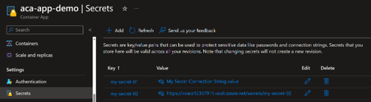
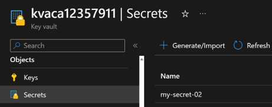
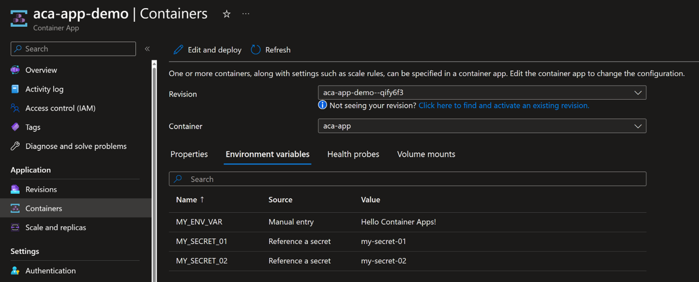
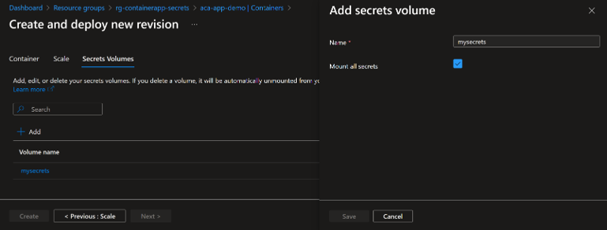

# Securing Secrets in Azure Container Apps

## Introduction

Azure Container Apps allows your application to securely store sensitive configuration values. 
Once secrets are defined at the application level, secured values are available to revisions in your container apps.

An updated or deleted secret doesn't automatically affect existing revisions in your app. When a secret is updated or deleted, you can respond to changes in one of two ways:

Deploy a new revision.
Restart an existing revision.

## 1. Creating secrets and reference Key vault secrets

Secrets are defined as a set of name/value pairs. 
The value of each secret is:
1. specified directly 
2. or as a reference to a secret stored in Azure Key Vault

You can reference Secrets from Key vault.

You can expose secrets as environment variables.

## 2. Referencing secrets in environment variables

After declaring secrets at the application level as described in the defining secrets section, you can reference them in environment variables when you create a new revision in your container app. When an environment variable references a secret, its value is populated with the value defined in the secret.

## 3. Mounting secrets in a volume

After declaring secrets at the application level as described in the defining secrets section, you can reference them in volume mounts when you create a new revision in your container app. When you mount secrets in a volume, each secret is mounted as a file in the volume. The file name is the name of the secret, and the file contents are the value of the secret. You can load all secrets in a volume mount, or you can load specific secrets.

