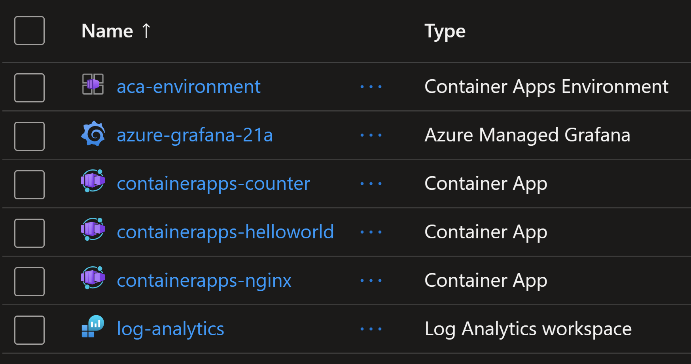
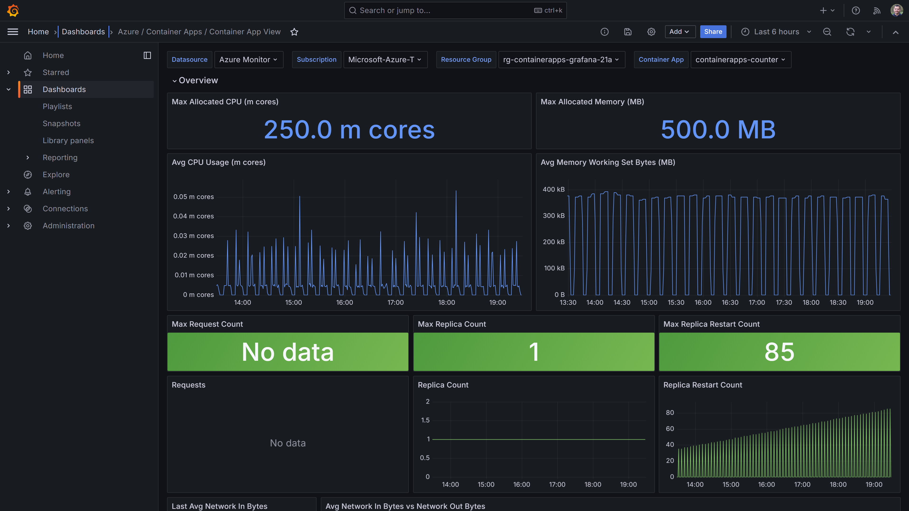
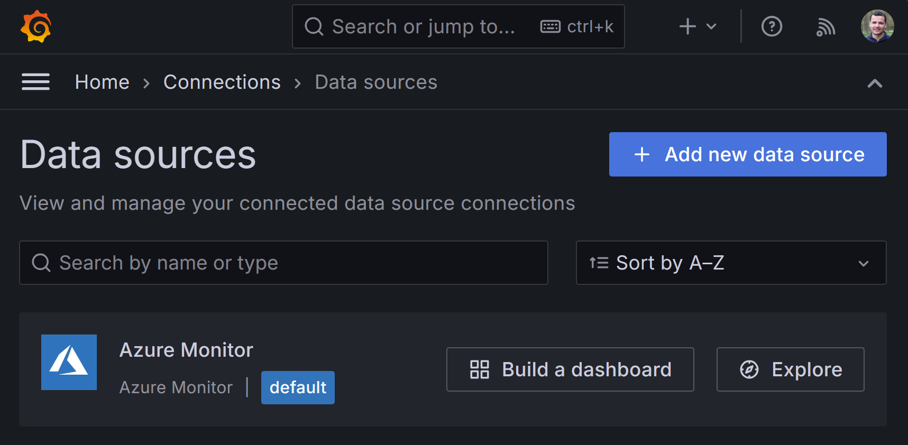
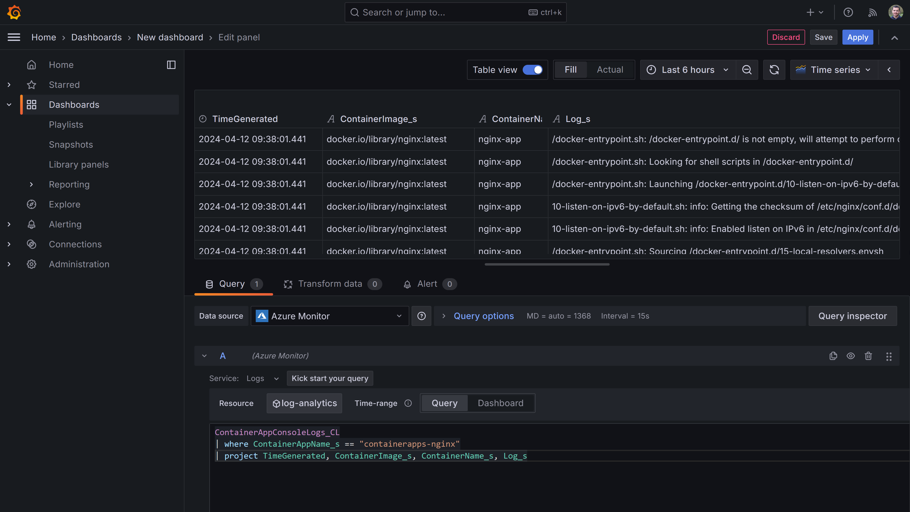

# Grafana Dashboard for Container Apps metrics and logs

You will learn how to visualize `Container Apps` logs and metrics in `Azure Managed Grafana` dashboards.

Deploy the infra resources using `Terraform`.

```sh
terraform init
terraform plan -out tfplan
terraform apply tfplan
```

The following resources will be created.



## Create Grafana Dashboard for metrics

Import a Grafana dashboard to visualize Container Apps metrics.

Src: https://grafana.com/grafana/dashboards/16592-azure-container-apps-container-app-view/

```sh
az grafana dashboard import -n azure-grafana-21a --definition 16592
```

You should get the following dashboard.



## Create Grafana Dashboard for logs

Create a new Grafana dashboard and use the following Kusto query (KQL) to get `Container Apps` console and system logs.
Make sure to select the `Azure Monitor` data source connector.

```sql
ContainerAppConsoleLogs_CL
| where ContainerAppName_s == "containerapps-nginx"
| project TimeGenerated, ContainerImage_s, ContainerName_s, Log_s
```



You should get the following dashboard.

