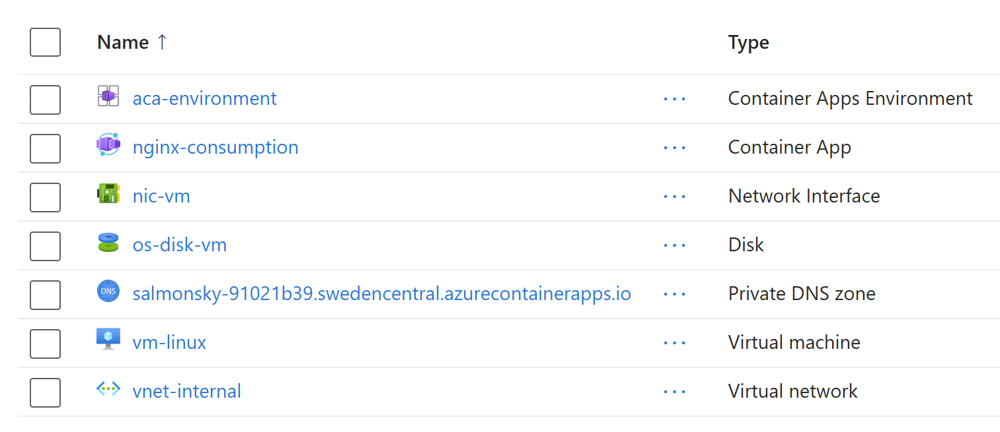
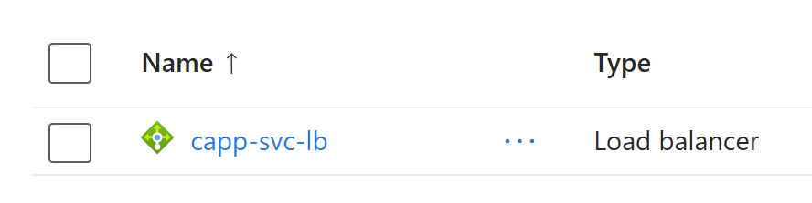

# Internal Container Apps with Consumption plan


## Introduction

This demonstration shows that when you deploy `Azure Container Apps` in an `Internal` network with a `Consumption` plan:
1) ACA app deployed with `Consumption plan` can connect to VNET resources like VMs and Azure services like `Azure Key Vault`
2) Resources within the VNET can connect to ACA app

To deploy this architecture using `terraform`:

```sh
terraform init
terraform plan -out tfplan
terraform apply tfplan
```

The following resources will be created:



In addition to an Internal (private) Load Balancer:



## Demoing ACA app access to a VNET resource

To demonstrate that the ACA app can connect to a VNET resource, the `terraform` template deployed a VM in the same VNET as the ACA app. The VM will have a simple web server running on port 80.

Now you just need to `exec` into the ACA app and `curl` the VM's IP address:

```sh
az containerapp exec --resource-group rg-aca-private-consumption-24 --name nginx-consumption --command "/bin/bash"
```

Then use `curl` to access the VM's IP address, make sure to change the IP address to the one you have:

```sh
curl 10.0.1.4
# Hello from virtual machine: vm-linux, with IP address: 10.0.1.4
```

## Demoing VNET resource access to ACA app

To demonstrate that the VM can connect to the ACA app, you can access into the VM and `curl` the ACA app's `fqdn`, make sure to change the `fqdn` to the one you have:

```sh
curl https://nginx-consumption.salmonsky-91021b39.swedencentral.azurecontainerapps.io
# <h1>Welcome to nginx!</h1>
# <p>If you see this page, the nginx web server is successfully installed and
# working. Further configuration is required.</p>
```


## Notes

To deploy the `Azure Container Apps` in an `Internal` network, you will need to create at least one `Workload Profile`. If you don't need it, you can configure its scalability to be between 0 and 1. When it is not used, it will be always 0, so you won't be charged for it.