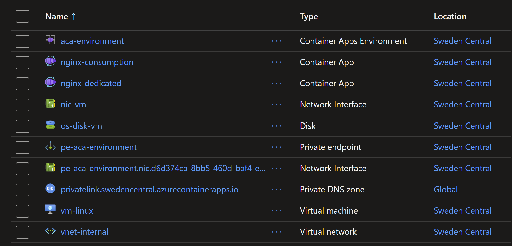
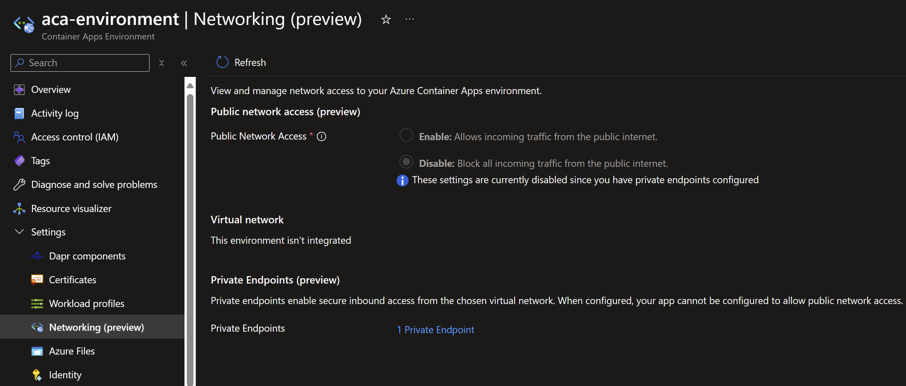
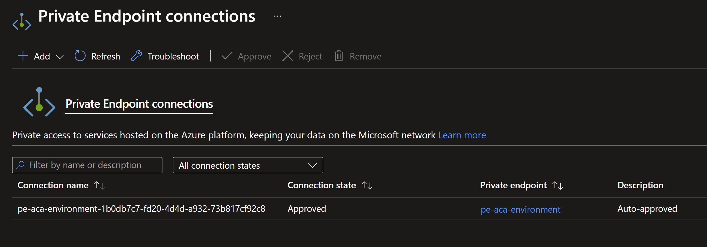
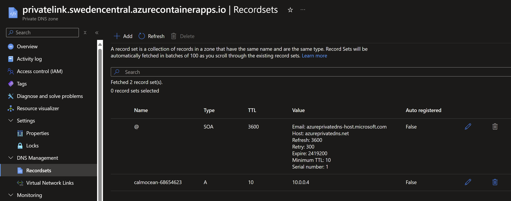
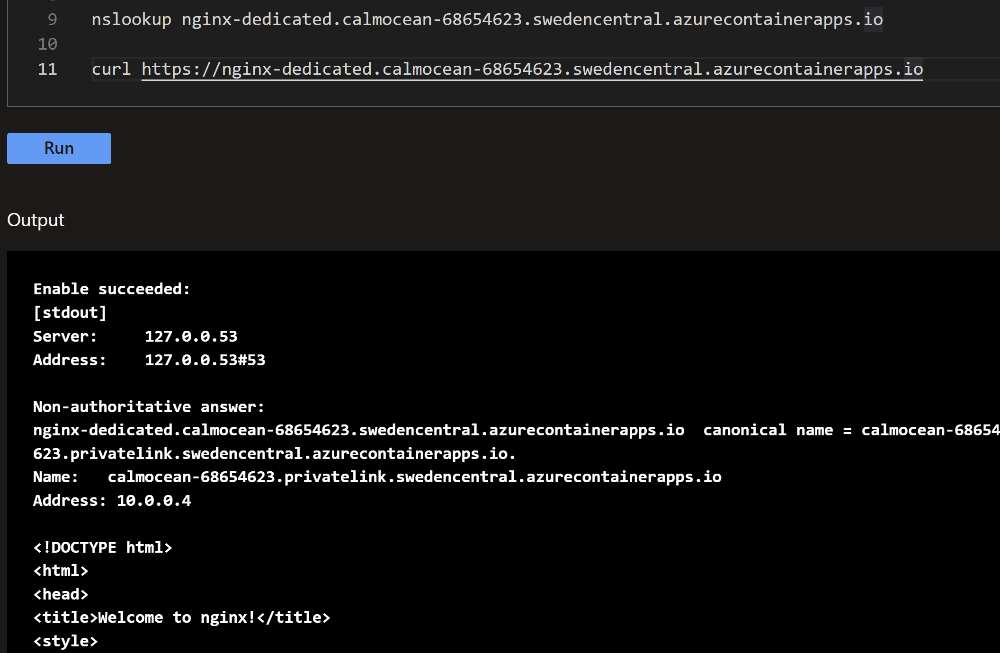

# Azure Container Apps with Private Endpoint

## Introduction

Container Apps now support Private Endpoint, which allows you to access your containerized applications securely from your virtual network. This lab shows you how to deploy a containerized application with a private endpoint.

## Deploy the infrastructure with Terraform

```sh
terraform init
terraform plan -out tfplan
terraform apply tfplan
```

The following resources will be created:



## Configuration of the Private Endpoint and Private DNS Zone







