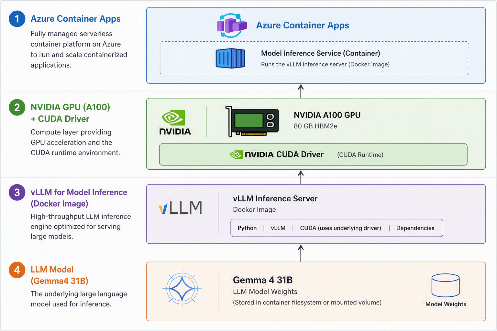

# Deploying LLMs on Serverless GPU with Azure Container Apps

This project demonstrates how to deploy large language models (LLMs) on Azure Container Apps using serverless GPU capabilities. The example focuses on deploying the `Qwen-36B` model and `Gemma 4 31B` powerful LLMs, on an `NVIDIA A100` GPU.



On Azure Container Apps you can use Serverless GPU to run your containerized applications on demand, without having to manage the underlying infrastructure. The available GPU types include `NVIDIA A100`, `NVIDIA T4`. The supported GPU types are avialble with the following command.

```bash
az containerapp env workload-profile list-supported --location swedencentral -o table
Location       Name
# -------------  -------------------------
# swedencentral  D4
# swedencentral  D8
# swedencentral  D16
# swedencentral  D32
# swedencentral  E4
# swedencentral  E8
# swedencentral  E16
# swedencentral  E32
# swedencentral  Consumption
# swedencentral  Flex
# swedencentral  Consumption-GPU-NC24-A100
# swedencentral  Consumption-GPU-NC8as-T4
```


### Dedicated profile details

| Classification | Profile names | vCPU range | Memory range | GPU type | Regions | Allocation |
| --- | --- | --- | --- | --- | --- | --- |
| General Purpose | **D4, D8, D16, D32** | 4–32 | 16–128 GiB | None | All supported regions | per node |
| Memory Optimized | **E4, E8, E16, E32** | 4–32 | 32–256 GiB | None | All supported regions | per node |
| Confidential Compute | **DC4, DC8, DC16, DC32, DC48, DC64, DC96** | 4-96 | 16-384 GiB | None | UAENorth | per node |
| GPU | **NC24-A100, NC48-A100, NC96-A100** | 24–96 | 220–880 GiB | A100 | West US 3, North Europe | per node |

### Flexible profile details (preview)

| Profile names | vCPU range | Memory range | Regions | Allocation |
| --- | --- | --- | --- | --- |
| **Flexible** | 0.25-4 | 0.5-16 GiB | Australia East, Brazil South, Canada Central, Canada East, Central India, East Asia, Germany West Central, Korea Central, North Europe, Southeast Asia, Sweden Central, UK West, West Central US, West US 3 | per replica |

### Cost of GPU serverless profiles

### NC T4 v3 Monthly Cost Breakdown

| Resource                | Calculation                       | Monthly Cost ($) |
| ----------------------- | --------------------------------- | ---------------- |
| NC T4 v3 (GPU)          | 0.000095 × 60 × 60 × 24 × 30      | 246.24           |
| NC T4 v3 (vCPU ×8)      | 0.000024 × 60 × 60 × 24 × 30 × 8  | 497.664          |
| NC T4 v3 (Memory ×56GB) | 0.000003 × 60 × 60 × 24 × 30 × 56 | 435.456          |
| **TOTAL**               | 246.24 + 497.664 + 435.456        | **1,179.36**     |

### NC A100 v4 Monthly Cost Breakdown

| Resource                   | Calculation                        | Monthly Cost ($) |
| -------------------------- | ---------------------------------- | ---------------- |
| NC A100 v4 (GPU)           | 0.000688 × 60 × 60 × 24 × 30       | 1,783.296        |
| NC A100 v4 (vCPU ×24)      | 0.000024 × 60 × 60 × 24 × 30 × 24  | 1,492.992        |
| NC A100 v4 (Memory ×220GB) | 0.000003 × 60 × 60 × 24 × 30 × 220 | 1,710.72         |
| **TOTAL**                  | 1,783.296 + 1,492.992 + 1,710.72   | **4,987.008**    |

*The GPU prices shown above are in addition to the active usage vCPU and RAM prices for your Container App

Azure VM and AKS (NC24ads_A100_v4) : **$3,438 / month**

Gemma4 is using 2 vCPU and 16GB Memory (you don’t pay for unallocated vCPU and Memory)

1,783 + (0.000024 × 60 × 60 × 24 × 30 × 2) + (0.000003 × 60 × 60 × 24 × 30 × 16) = **$2,032 / month**

## Important notes

* In Serverless GPU profiles, the GPU cost is in addition to the active usage vCPU and RAM prices for your Container App.
You pay for the entire GPU cost, even if your Container App only uses a fraction of the GPU's resources.
But, for CPU and Memory, you only pay for the resources your Container App actually reserves.
To reduce cost, it is very important to right-size the vCPU and Memory for your Container App when using Serverless GPU profiles. You can use Azure Monitor to track the actual resource usage of your Container App and adjust the vCPU and Memory accordingly.
